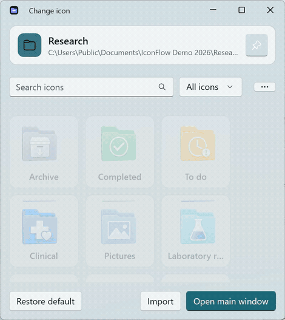
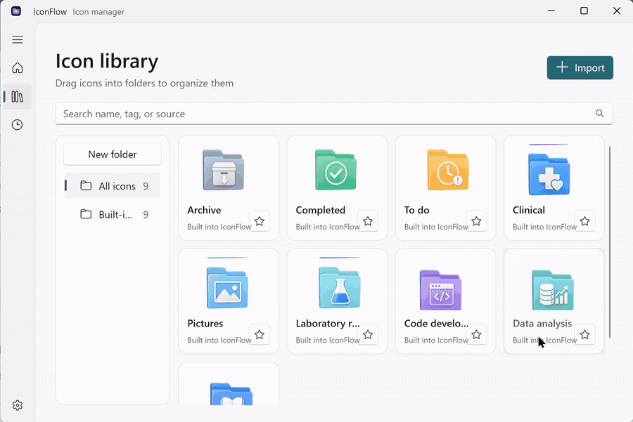

<div align="center">
  
  <h1>IconFlow</h1>
  <p><strong>Make Windows folders easier to recognize—and easier to undo.</strong><br>让 Windows 文件夹一眼可辨，也随时可恢复。</p>
  <p>Native WinUI 3 · Local-first · Reversible<br>原生 WinUI 3 · 本地处理 · 可撤销</p>
  <p>
    <a href="https://github.com/mishzx/IconFlow/releases/latest"><strong>Download for Windows</strong></a> ·
    <a href="#three-steps">Quick start</a> ·
    <a href="README.zh-CN.md">中文文档</a>
  </p>
  <p>
    <a href="https://github.com/mishzx/IconFlow/releases/latest"></a>
    <a href="https://github.com/mishzx/IconFlow/actions/workflows/build.yml"></a>
    <a href="LICENSE"></a>
    
  </p>
  <p>English · <a href="README.zh-CN.md">简体中文</a> · <a href="README.ja.md">日本語</a> · <a href="README.es.md">Español</a></p>
</div>

<div align="center">
  
</div>

## A small tool for a surprisingly fragmented job

Changing a Windows icon should not require understanding ICO layers, `desktop.ini`, shortcut internals or Explorer caches. IconFlow turns that workflow into one compact, reversible action: choose an object, pick an icon, and apply. The original state is backed up automatically.

| Native and light | Local by design | Recovery first |
|:--|:--|:--|
| .NET 8, Windows App SDK and WinUI 3—no Chromium process. | No account, telemetry, upload or background network service. | Every applied icon gets a stable copy, history entry and undo path. |

## Three steps

1. Right-click a folder or shortcut and choose **Change icon**.
2. Search your library, import an image, or choose a built-in Fluent folder icon.
3. Click the icon. IconFlow applies it, refreshes Explorer and keeps **Undo** ready.

The compact picker opens near the cursor, stays inside the working area, is always on top by default, and accepts dragged images.

## What is included

- Folder and `.lnk` shortcut icon replacement.
- A compact File Explorer picker plus a full local icon library.
- PNG, JPG/JPEG, WEBP, SVG, BMP and ICO import; EXE icon extraction.
- Multi-layer ICO output at 16, 24, 32, 48, 64, 128 and 256 px, with 256 px preview caching.
- Crop, scale, padding, rounded corners, base shapes and connected-background removal.
- Search, favorites, tags, duplicate detection and draggable icon folders.
- Grouped recovery history with before/after previews, open-location and undo actions.
- Light, dark and system themes with 100–200% DPI support.
- Locales for 11 interface languages, including Arabic RTL; translation reviews are welcome.

<details>
<summary><strong>See the full interface</strong></summary>
<br>
<div align="center"></div>
</details>

## Download

Download the latest `win-x64-portable.zip` from [GitHub Releases](https://github.com/mishzx/IconFlow/releases/latest), extract it to a stable writable folder, and run `IconFlow.exe`.

Requirements: Windows 10 22H2 or Windows 11 23H2+, x64, .NET 8 Desktop Runtime and Windows App Runtime 2.4.

IconFlow does not start with Windows or remain in the tray by default. If silent startup is enabled later, it performs lightweight maintenance without showing a window and exits.

### Windows 11 context menu

The optional first-level Windows 11 menu uses an `IExplorerCommand` sparse package. Run `Install-Win11Menu.ps1`, or open **Settings → Install / Repair Windows 11 menu**; Windows requests one UAC confirmation to install the package and its project-local development certificate. The portable compatibility menu works for the current user without elevation under **Show more options**.

Review [SECURITY.md](SECURITY.md) and the release notes before installing the development-signed menu package. The portable app itself does not require certificate installation.

## Privacy and scope

Application data stays under `%LocalAppData%\IconFlow` unless you move the library. IconFlow does not upload file names, paths, desktop contents, installed-app lists, imported images or history. See [PRIVACY.md](PRIVACY.md).

The current stable core supports folders and shortcuts. System desktop icons, file-type associations, taskbar icons, Start menu internals and bulk matching rules are not part of this release.

## Build from source

```powershell
dotnet build native\IconFlow.WinUI\IconFlow.WinUI.csproj -c Release
dotnet run --project native\IconFlow.Native.Tests\IconFlow.Native.Tests.csproj -c Release
powershell -ExecutionPolicy Bypass -File scripts\build-native.ps1
```

- `native/IconFlow.Core` — storage, image conversion, recovery and Windows integration.
- `native/IconFlow.WinUI` — native Fluent interface.
- `native/IconFlow.ShellExtension` — Windows 11 `IExplorerCommand` extension.
- `native/IconFlow.Native.Tests` — executable regression suite.

## Contributing

Bug reports, translation reviews and focused improvements are welcome. Read [CONTRIBUTING.md](CONTRIBUTING.md) and [SECURITY.md](SECURITY.md), then open an issue or join [Discussions](https://github.com/mishzx/IconFlow/discussions).

## License

[MIT](LICENSE) © IconFlow contributors.
